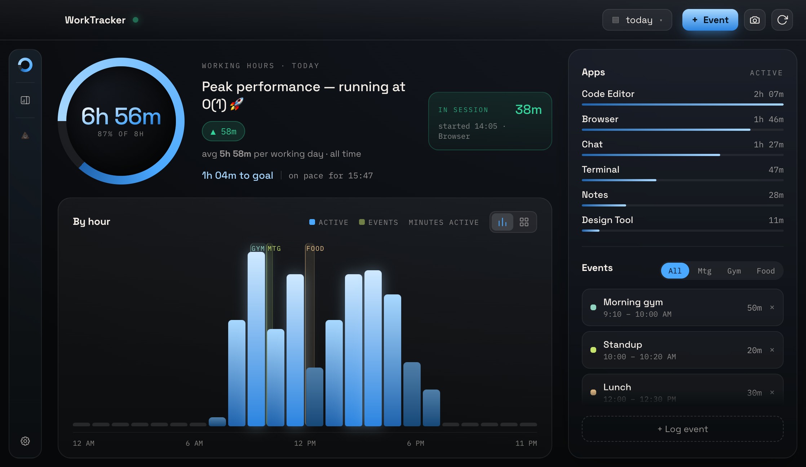
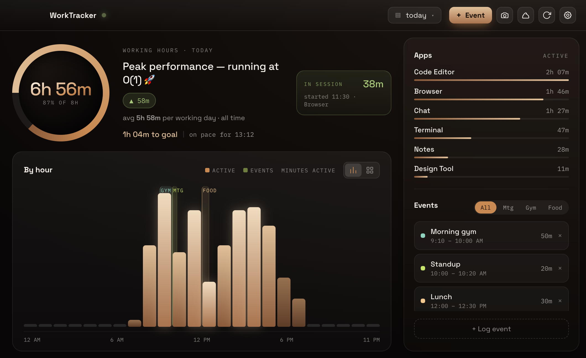
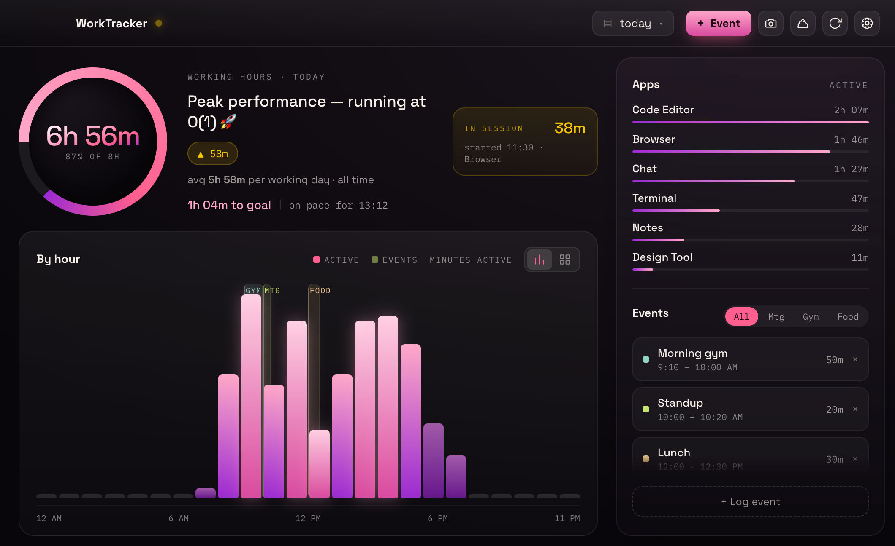

# WorkTracker

A small macOS app that measures **how much you're actually working** — not how long your laptop was on.



> Apple Silicon (M1–M4) · macOS 11+ · everything stays on your Mac

---

## Install

### Option A — direct download (no Homebrew needed)

1. Download **[WorkTracker.dmg](../../releases/latest)** from the latest release
2. Open it and drag **WorkTracker** into **Applications**
3. Run this once in Terminal, then open the app normally:

```bash
xattr -cr /Applications/WorkTracker.app
```

> **Why step 3?** The app isn't notarized by Apple (it's a personal project, not
> a paid developer account), so macOS quarantines it and refuses to open it
> until that flag is cleared. Skip it and you'll get a scary warning — the app
> is fine, it's just unsigned.

**Updates are automatic from here on.** When a new version ships, an
**⬆︎ Update to vX.Y.Z** button appears in the app — one click downloads and
installs it, then relaunches. No re-downloading, no Terminal, no Gatekeeper
prompt (updates the app fetches itself aren't quarantined).

### Option B — Homebrew (recommended: one-command updates)

```bash
brew tap alontzukerman/worktracker
brew trust --cask alontzukerman/worktracker/worktracker
brew install --cask worktracker
xattr -cr /Applications/WorkTracker.app
```

Then every future update is just:

```bash
brew upgrade --cask worktracker
```

---

## What it does

**Tracks real work, automatically.** Every 15s it asks macOS how long since your
last input. Actively using the machine counts; idle past 2 minutes doesn't. No
keylogging — it never sees *what* you type.

**Counts meetings as work.** Log a meeting and it counts even though you weren't
typing. Time spent working *during* a meeting is never double-counted.

**Pause when you're not working.** Watching something on the commute? Click the
status dot — or the menu-bar icon — and pick **30 min · 1 hour · until tomorrow ·
until I resume**. Everything but the last auto-resumes when it expires, so a
forgotten pause can't swallow your day.

**Log life, too.** Gym and food are tracked and charted, but never counted as work.

---

## The dashboard

- **Daily goal dial** — pick a target (2–14h) and see how far along the day is
  at a glance
- **Today · Last 7 days · Last 30 days · All time**, plus any custom date range
- **Pace** — how much is left today, and what time you'll reach the goal at this rate
- **Live session** — how long this stretch of work has been going, and in which app
- Activity **by hour, by day or by month**, with anything you logged drawn as
  bands behind today's hours
- Your top apps and your logged events, in the rail
- 📸 **Day snapshot** — export a shareable card, including how the day
  compares to your all-time average
- Drag the window narrow and it becomes a compact glance card

From the menu bar: a small card with today's total, your progress toward the
goal, and the focused / meetings split. `⌥⌘P` pauses and `⌥⌘N` logs an event from
anywhere.

### Themes

**Light, dark, or follow the system** — and six palettes that retint the entire
app, including exported snapshots. Amber is the default. Light mode is derived
from whichever palette you pick, so each one keeps its own character rather than
collapsing to the same white.

| Espresso ☕ | Pride 🏳️‍🌈 |
|---|---|
|  |  |

---

## Privacy

Everything is local. No account, no telemetry, nothing uploaded — ever.

Your data lives in `~/Library/Application Support/WorkTracker/`:

| File | Contents |
|---|---|
| `activity.json` | per-minute activity samples |
| `events.json` | meetings / gym / food you logged |
| `settings.json` | your preferences |

Delete that folder and it's all gone. Uninstall completely with
`brew uninstall --zap --cask worktracker`.

### Permissions

On first launch macOS asks for two, both optional:

- **Automation (System Events)** — to read the frontmost app name, for the
  "top apps" breakdown
- **Notifications** — to tell you when a pause has ended

Decline them and time tracking still works; you just lose those two features.

---

## Notes

- Apple Silicon only right now. Open an issue if you need an Intel build.
- Screenshots use sample data.
